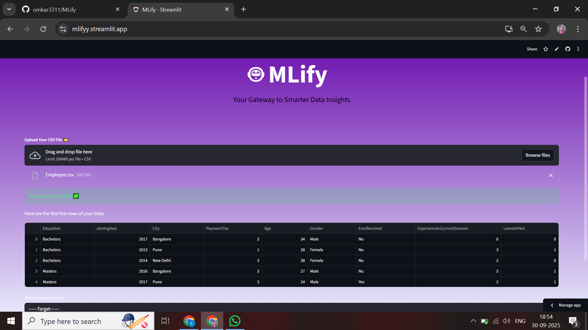

# MLify

An interactive web application built with **Streamlit** that allows users to:
- Upload datasets (`.csv` format)
- Perform automated **EDA (Exploratory Data Analysis)** with visualizations
- Train **classification or regression models** automatically
- Compare model performance
- Download the best trained model as a `.pkl` file

---

## 🚀 Features

- 📂 **Upload CSV**: Load your dataset directly from the UI.  
- 🔍 **EDA + Summary**: View dataset shape, summary statistics, and duplicates.  
- 📊 **Visualizations**: Automatic generation of categorical and numerical plots, along with a heatmap.  
- 🤖 **Model Training**:  
  - **Classification** → RandomForest & LogisticRegression  
  - **Regression** → LinearRegression  
- 📥 **Export Best Model**: Download the trained model as a pickle file.  
- ⏳ **Loading Spinners**: Displays progress indicators for professional UX.  
- ⬅️➡️ **Navigation**: Move forward and backward across app pages.

---



---
## 📦 Installation

Clone the repository and install dependencies:

```bash
git clone https://github.com/your-username/automl-app.git
cd automl-app
pip install -r requirements.txt
```
▶️ Usage
Run the Streamlit app:
```bash
streamlit run app.py
```
Open your browser at http://localhost:8501
